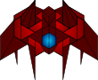
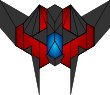

# Space Shooter Game

This is a shooter game created with phaser 3, in this game you must destroy enemy spaceships to get points there are 3 diferent types of enemies which will do diferent actions and will give you an specific amount of points.

## Built With

- Phaser 3
- Webpack
- Javascript

## Live Demo

<a href="https://rawcdn.githack.com/julian3493/js-capstone-shooter-game/602815df1ca38caa7653f35e57aea50673859627/dist/index.html" target="_blank">Live version</a>

## Getting Started

To get a local copy up and running follow these simple example steps.

### Setup

- Clone this repository. Type `git clone https://github.com/julian3493/js-capstone-shooter-game.git`
- Navigate to the project folder (js-capstone-shooter-game) `cd js-capstone-shooter-game`

### Run Game Locally
- Type `npm run start` in the console

### Run Test
- - Type `npm test` in the console

## Game Design

### List of Scenes
- Boot
- Preloader
- Title
- Game
- Options
- Credits
- Highscores

### Game Controls
|Command | Action |
|-------|-------|
|Left Arrow| To move left |
|Right Arrow| To move right |
|Up Arrow| To move up |
|Down Arrow| To move left |
|Space | Shoot laser |

### Enemies info

|Space Ship                                      |Description                            |Points                |
|-------------------------------------------|---------------------------------------|--------------------|
|   |It is the biggest and the easiest to avoid |10             |
| |This spaceship shoots direct to the bottom of the screen | 30|
|  |A little and rounded object that will follow you  | 50 |

## Author
​
👤 **Julian Ramos**
​

[<code></code>](https://github.com/julian3493)
[<code></code>](https://twitter.com/JulianR16893833)
[<code></code>](https://www.linkedin.com/in/julian-ramos-arevalo/)
[<code></code>](mailto:julianramosarevalo@gmail.com)

## 🤝 Contributing

Contributions, issues and feature requests are welcome!

Feel free to check the <a href="https://github.com/julian3493/js-capstone-shooter-game/issues"> issues page</a>.

## Show your support

Give a ⭐️ if you like this project!

## Acknowledgments

- <a href="https://learn.yorkcs.com/category/tutorials/gamedev/phaser-3/build-a-space-shooter-with-phaser-3/" target="_blank">York Computer Solutions</a>
- <a href="https://www.stackoverflow.com/" target="_blank">Stackoverflow</a>
- <a href='http://carlosalface.blogspot.pt/'>Carlos Alface</a>